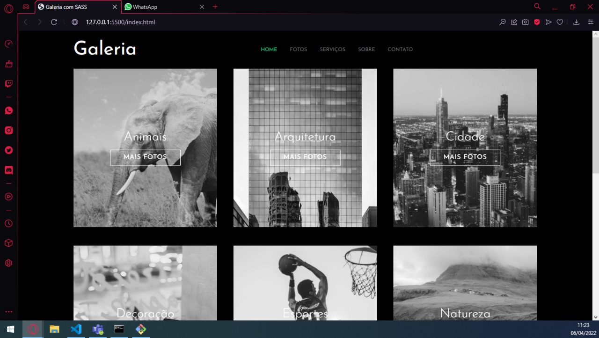
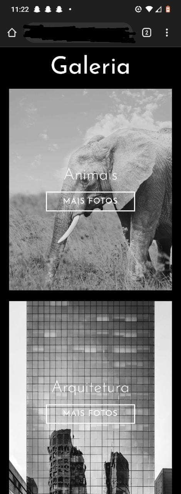

# Instalação do SASS

If you use Node.js, you can also install Sass using npm by running

``npm install -g sass`

if you use the Chocolatey package manager for Windows, you can install Dart Sass by running

`choco install sass`

Install on Mac OS X or Linux (Homebrew)
If you use the Homebrew package manager for Mac OS X or Linux, you can install Dart Sass by running

`brew install sass/sass/sass`

# Comando para compilar o sass

  <li>Terminal >> sass --watch <path do sass>:<arquivo que vai gerar do sass></li>

# Exemplo

<ol>
    <li>[1] Terminal >> sass --watch sass/styles.sass:css/styles.css</li>
</ol>

# Mixins

Mixins ele é como se fosse uma "função" , Para usar os mixins basta colocar

`@include mixins.nome`

# Selector Parent

&-brand == .header-brand

# Desktop View Page

# Mobile View Page

